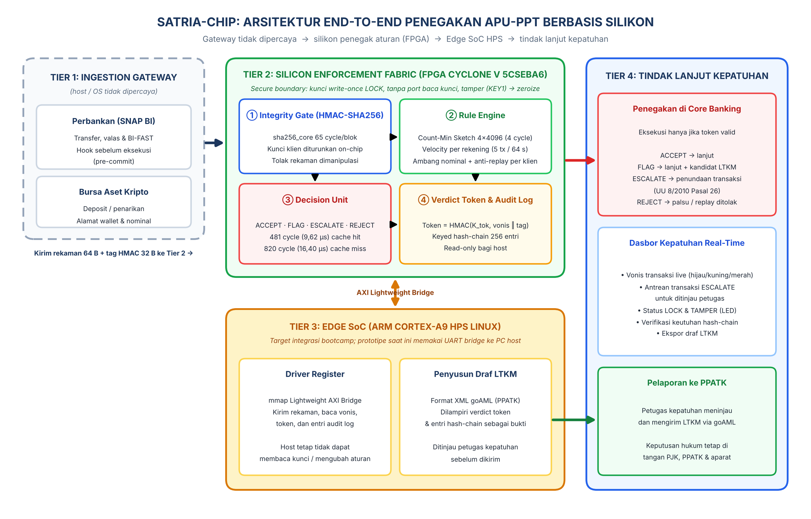

# SATRIA-CHIP — Penegakan APU-PPT Berbasis Silikon

PERURI Chip Hackathon 2026 · Tim Paket Kulit 12k · Telkom University

**Kategori:** IC Chip Design & FPGA Implementation
**Topik Desain:** 01 — Secure Identity & Security Element Chip / Hardware Security Accelerator

---

## Ringkasan

**SATRIA-CHIP** (*Sistem Akselerasi Penapisan Transaksi Real-Time & Isolasi Aset*) adalah co-processor keamanan FPGA yang memindahkan keputusan penapisan transaksi mencurigakan (lolos / tandai / tunda / tolak) beserta catatan auditnya ke dalam batas silikon tepercaya, sehingga aturan anti-pencucian uang **tidak dapat dimatikan, dilonggarkan, atau dihapus jejaknya** walaupun OS gateway dikompromi.

### Urgensi (data resmi)

| Data | Angka | Sumber |
|---|---|---|
| LTKM diterima PPATK 2025 | 183.281 laporan; 47,49% terkait judi online | PPATK via ANTARA, 29 Jan 2026 |
| Laporan penundaan transaksi 2025 | 14.204 (naik 484,8%) | PPATK via ANTARA |
| Perputaran dana judi online 2025 | Rp286,82 T; deposit Rp36,01 T; 12,3 juta penyetor | Catatan Capaian PPATK 2025 |
| Dana judi online dilarikan ke luar negeri via kripto (2024) | ±Rp30 T (mixer/tumbler) | Ketua PPATK, Feb 2025 |
| Anomali trafik siber Jan–Nov 2025 | 5,2 miliar; sektor keuangan paling rentan | BSSN |

Dasar hukum: UU No. 8/2010 Pasal 26 (penyedia jasa keuangan dapat menunda transaksi maks. 5 hari kerja) dan POJK No. 8/2023 (APU-PPT).

### Cara kerja chip (5 tahap on-chip)

1. **Integrity Gate (HMAC-SHA256)** — rekaman 64 byte yang diubah setelah ditandatangani sistem sumber ditolak.
2. **Rule Engine** — velocity per rekening (default >5 transaksi / 60 detik) dan ambang nominal pada Account State Memory 64 slot, plus anti-replay.
3. **Decision Unit** — `ACCEPT` (lanjut), `FLAG` (lanjut + kandidat LTKM), `ESCALATE` (ditunda untuk ditinjau petugas), `REJECT` (palsu/replay).
4. **Verdict Token** — HMAC dengan K_tok; core banking hanya mengeksekusi transaksi bertoken valid.
5. **Tamper-Evident Audit Log** — keyed hash-chain 256 entri, read-only bagi host.

**Batasan yang dinyatakan terbuka:** chip adalah lapisan penegakan aturan deterministik di gateway satu institusi. Analisis lintas rekening / lintas institusi (jaringan smurfing, penelusuran on-chain kripto) tetap di sistem analitik terpisah. Keputusan hukum (pembekuan, pemblokiran) tetap di tangan PJK, PPATK, dan aparat.

---

## Struktur berkas

| Berkas | Isi |
|---|---|
| `hardware-satria/rtl/` | RTL Verilog-2005: `sha256_round` (turunan TT07), `sha256_core`, `hmac_engine`, `key_vault`, `rule_engine`, `audit_log`, `screener_top`, `uart_bridge`, `de10_nano_top` |
| `hardware-satria/model/golden.py` | Golden model Python (bit-exact dengan RTL) + verifikator rantai log |
| `hardware-satria/tb/` | Testbench cocotb: skenario core, UART, waveform, regresi acak |
| `hardware-satria/quartus/` | Proyek Quartus Prime Lite 24.1 (5CSEBA6U23I7) + bitstream `output_files/screener.sof` |
| `hardware-satria/docs/` | Log simulasi, laporan Quartus (fit/sta/power), gambar |
| `hardware-satria/host/demo_uart.py` | Demo PC → board DE10-Nano lewat adaptor USB-UART |
| `aml_gateway_simulator.py` | Mengemas instruksi SNAP BI / bursa kripto menjadi rekaman 64 B + tag HMAC (kunci = golden model) |
| `str_generator.py` | Penyusun **draf** LTKM berformat XML bergaya goAML |
| `demo_dashboard/app.py` | Dasbor demo, tanpa dependensi eksternal |
| `test_dashboard_api.py` | Tes otomatis dasbor |
| `fig/` | Arsitektur end-to-end, diagram blok, pewaktuan 411 cycle, wiring board |



---

## Menjalankan demo

Tidak perlu `pip install` — cukup Python 3.8+:

```powershell
python demo_dashboard/app.py
```

Buka **http://127.0.0.1:3001**. Setiap vonis dihitung oleh golden model (`hardware-satria/model/golden.py`) yang bit-exact dengan RTL, dan latensi ditampilkan sesuai hasil simulasi RTL (411/750 cycle; 407/746 cycle untuk penolakan integritas).

| Tombol | Hasil yang diharapkan |
|---|---|
| Transfer sah (SNAP BI) | `ACCEPT`, 750 cycle (klien baru) lalu 411 cycle |
| Deposit bursa kripto sah | `ACCEPT`, 750 cycle (kunci klien lain diturunkan) |
| Lonjakan 6 transfer 1 rekening | 5× `ACCEPT`, ke-6 `FLAG VELOCITY` |
| Nominal Rp250 juta | `ESCALATE AMOUNT` → ditunda, draf LTKM bisa diunduh |
| Host mengecilkan nominal | `REJECT INTEGRITY` (407 cycle) |
| Host replay rekaman lama | `REJECT REPLAY` |
| Root melonggarkan ambang setelah LOCK | Status `TAMPER`, transaksi berikutnya `REJECT VAULT` |
| Audit: ubah / hapus / tukar entri | `TERDETEKSI` — rantai hash putus |

Tes otomatis: `python test_dashboard_api.py`.

Skenario yang sama di board DE10-Nano (lewat adaptor USB-UART): `python hardware-satria/host/demo_uart.py COM5`.

---

## Spesifikasi hardware (Cyclone V 5CSEBA6U23I7, Quartus Prime Lite 24.1)

* Clock 50 MHz; Fmax **75,04 MHz** (setup slack +6,67 ns)
* Latensi **411 cycle (8,22 µs)** cache hit / **750 cycle (15,00 µs)** cache miss; kapasitas core ±121.654 transaksi/detik
* **4.346 ALM (10%)**, 8.568 register, **15 M10K (±3%)**, **0 DSP**
* Estimasi daya **493,84 mW** @ 50 MHz (Power Analyzer, vectorless)
* 13/13 tes core lulus (12 skenario + laporan); regresi acak 10.000/10.000 transaksi bit-exact (log: `hardware-satria/docs/log_regresi_random_10000.txt`); 0 kebocoran kunci pada sapuan 256 alamat bus

---

Lisensi: `sha256_round` diturunkan dari TT07 *tiny sha256* (Apache-2.0, lihat `hardware-satria/rtl/LICENSE-TT07-sha256-Apache-2.0`).
